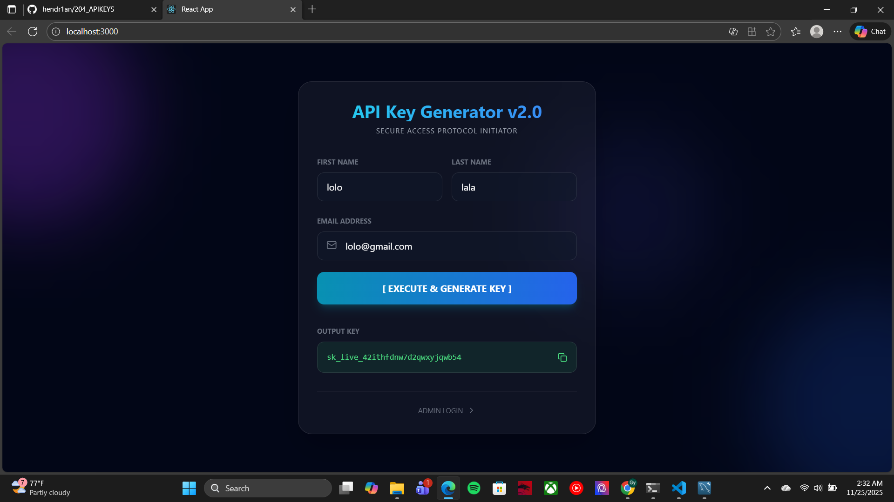
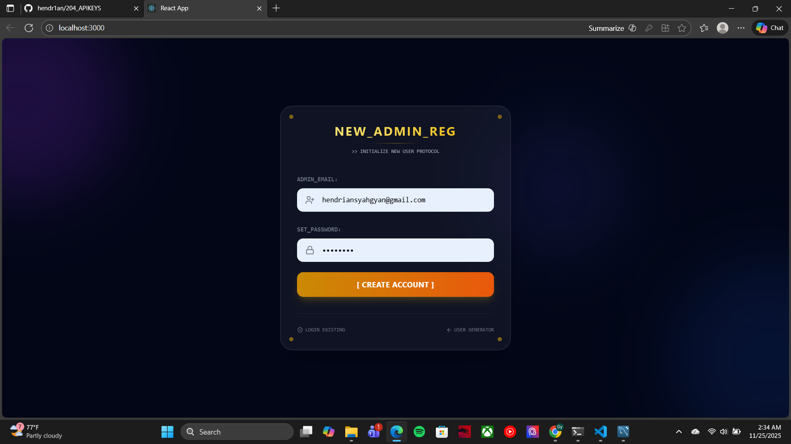
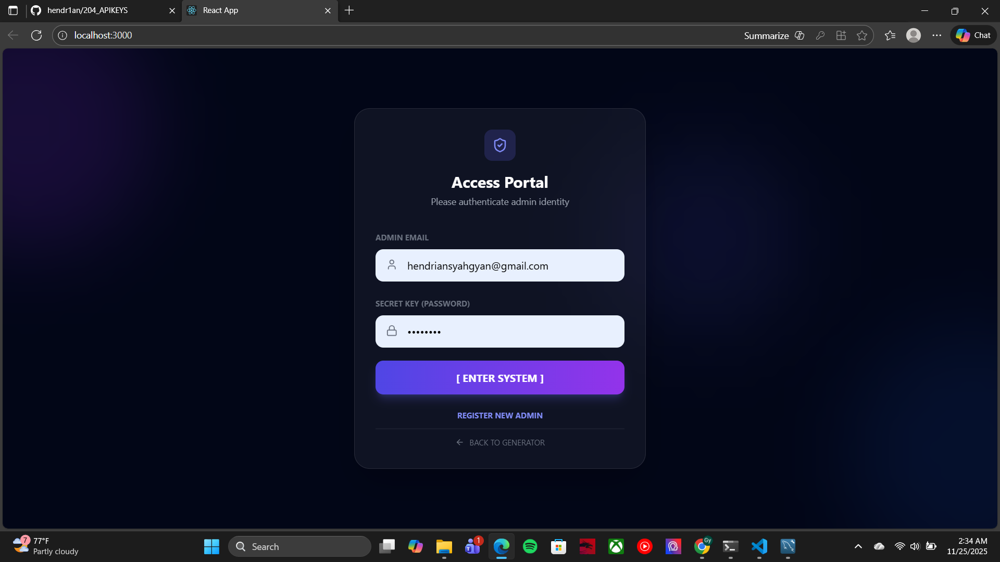
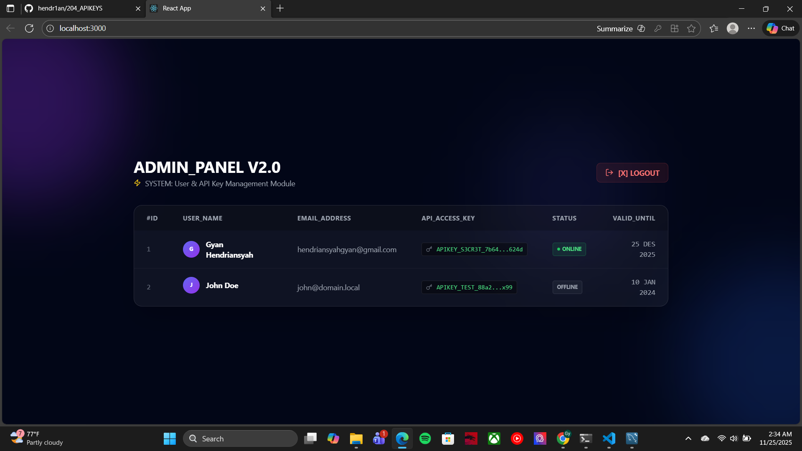

# Dokumentasi Aplikasi API Key Generator

Berikut adalah tampilan antarmuka aplikasi (Screenshot):

### 1. Halaman Generator (Public)
Halaman awal untuk user membuat API Key.

---

### 2. Halaman Registrasi Admin
Form untuk mendaftarkan akun admin baru.

---

### 3. Halaman Login Admin
Halaman untuk masuk ke dashboard admin.

---

### 4. Admin Dashboard (Panel)
Halaman utama admin untuk mengelola user dan API Key.
